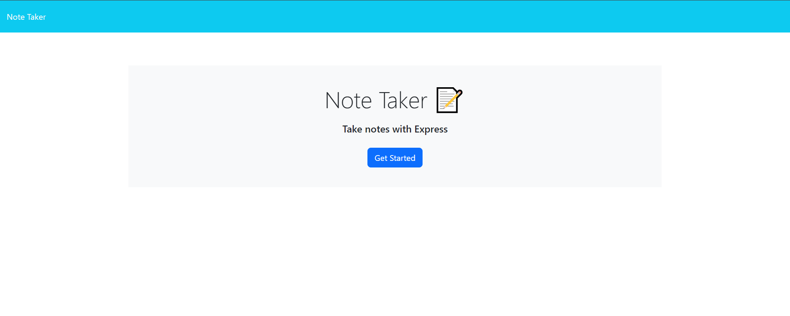
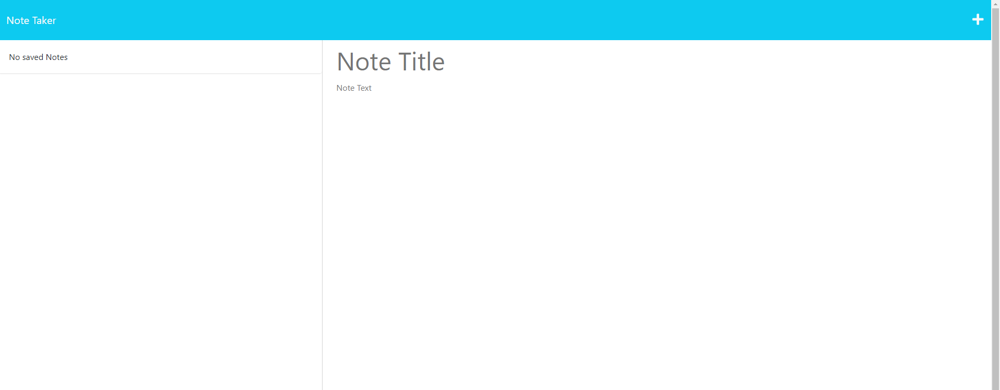
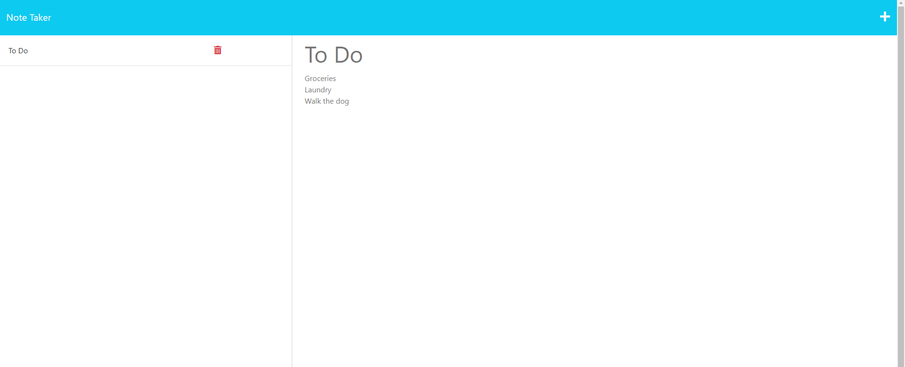
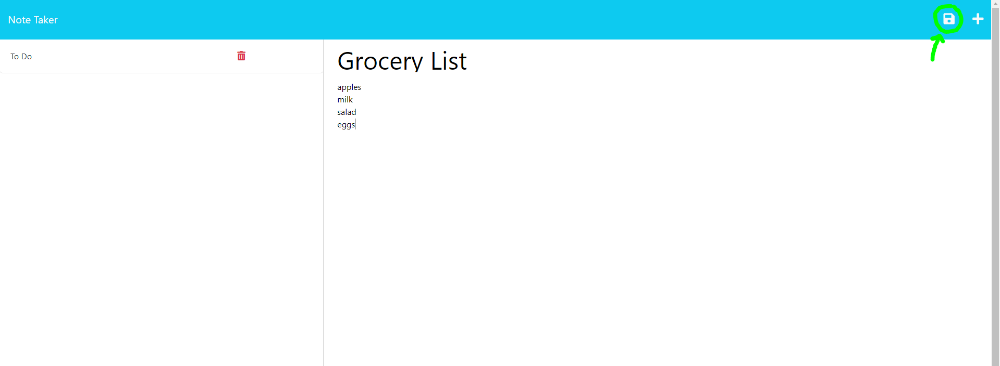
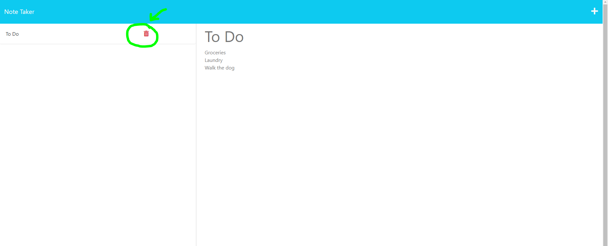

# Note Taker

## Description
Do you ever feel overwhelmed with the amoung of tasks you have to complete in one day? Or maybe you thought of a brilliant idea and need to write it down before it escapes you! The Note Taker is an application to write and save notes to organize your thoughts and keep track of those tasks.


## Table of Contents 

- [Installation](#installation)
- [Usage](#usage)
- [Code Snipits](#code-snipits)
- [Credits](#credits)
- [License](#license)

## Installation

https://github.com/TheRealMi/NoteTaker

## Usage
Follow this link to get to the Note Taker!
[Click here :)](https://notetaker-mo-4bf6fa91d433.herokuapp.com/)

You will be presented with the homepage with the blue "Get Started" button to begin writing your notes


Once you click the "Get Started" button, you will see an empty list with two text boxes beside it to begin writing your notes


To create a new note, click the (+) button at the top right hand side of the page, then type your note title and note body within the two text boxes


Save your note by clicking the Save button (floppy disc) at the top right hand side of the page.


If you'd like to delete a note, click the Delete button next to the note on the list


## Code Snipits
```
const readAndAppend = (content, file) => {
  fs.readFile(file, 'utf8', (err, data) => {
    if (err) {
      console.error(err);
    } else {
      const parsedData = JSON.parse(data);
      parsedData.push(content);
      writeToFile(file, parsedData);
      //returning the array with new note (we called it parsed data here)
      return parsedData;
    }
  });
};
```

```
const renderActiveNote = () => {
  hide(saveNoteBtn);

  if (activeNote.id) {
    noteTitle.setAttribute('readonly', true);
    noteText.setAttribute('readonly', true);
    noteTitle.value = activeNote.title;
    noteText.value = activeNote.text;
  } else {
    noteTitle.removeAttribute('readonly');
    noteText.removeAttribute('readonly');
    noteTitle.value = '';
    noteText.value = '';
  }
};
```
## Credits

[Coding Bootcamp](https://courses.bootcampspot.com)

[Bootcamp Starter Code](https://github.com/coding-boot-camp/miniature-eureka)

[Professor Phil Loy](https://github.com/philliploy)


## License

This project is licensed under the [MIT License](LICENSE).


